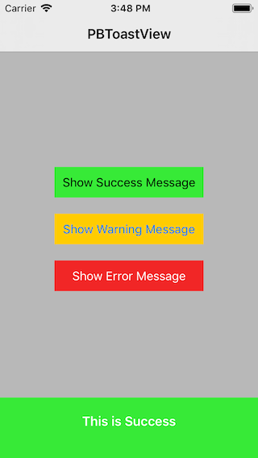
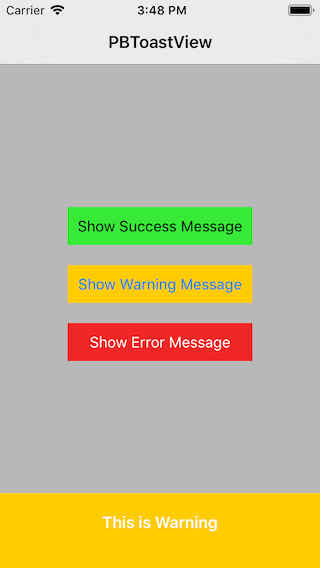
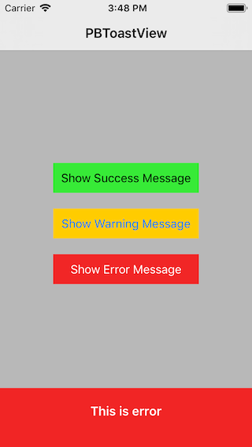

# PBToastView

Android-like toast with very simple interface.
<BR>PBToastView is written in Swift 4.2.
  
## Screenshots
[](Screenshots/Screenshot_1.png)
[](Screenshots/Screenshot_2.png)
[](Screenshots/Screenshot_3.png)

## At a Glance
```
let msgView = PBMessageView()
msgView.showMessage(messageType: .Error, message, view: self, direction: direction)
```

## Getting Started

### Error
Error will display message in Red background
```
let msgView = PBMessageView()
msgView.showMessage(messageType: .Error, message, view: self, direction: direction)
```

### Success
Success will display message in Green background
```
let msgView = PBMessageView()
msgView.showMessage(messageType: .Success, message, view: self, direction: direction)
```

### Warning
Warning will display message in Yellow background
```
let msgView = PBMessageView()
msgView.showMessage(messageType: .Warning, message, view: self, direction: direction)
```
